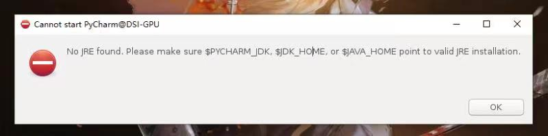

# Frequently Asked Questions

1. Cannot start pycharm: No JRE found Error (Asked by Weixun Luo, 2021.12.1)

   

   

A: The version of pycharm does not match with the version of JAVA. Please use pycharm-2021.1.2, which works on our servers.

