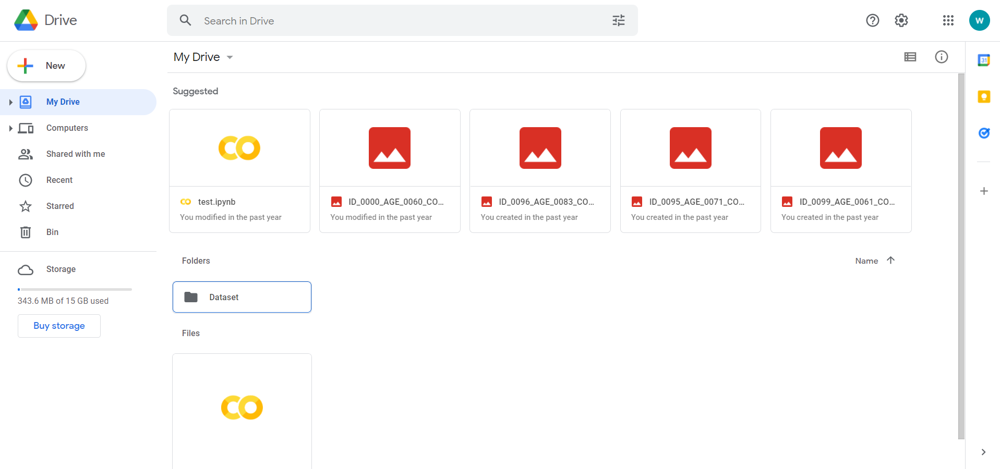
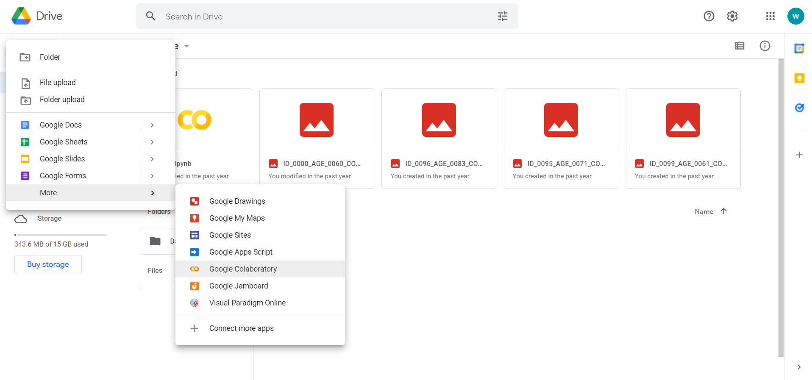
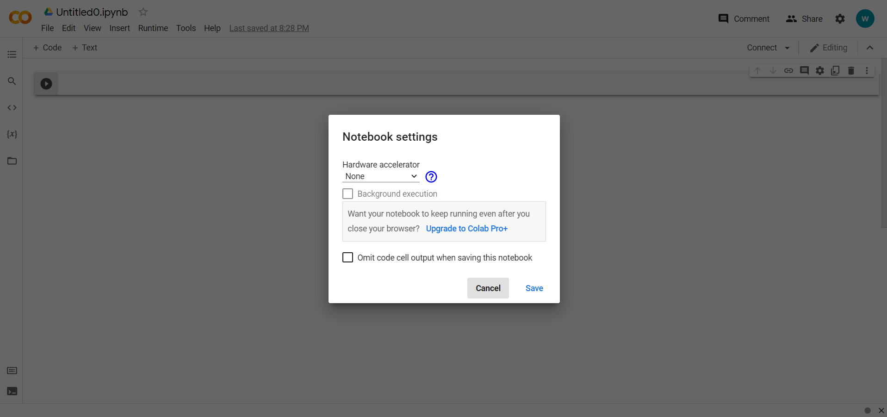
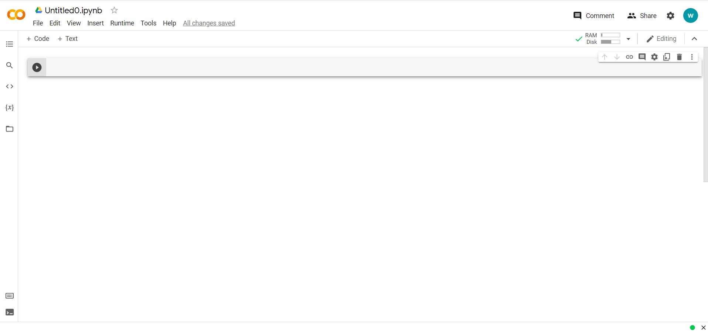
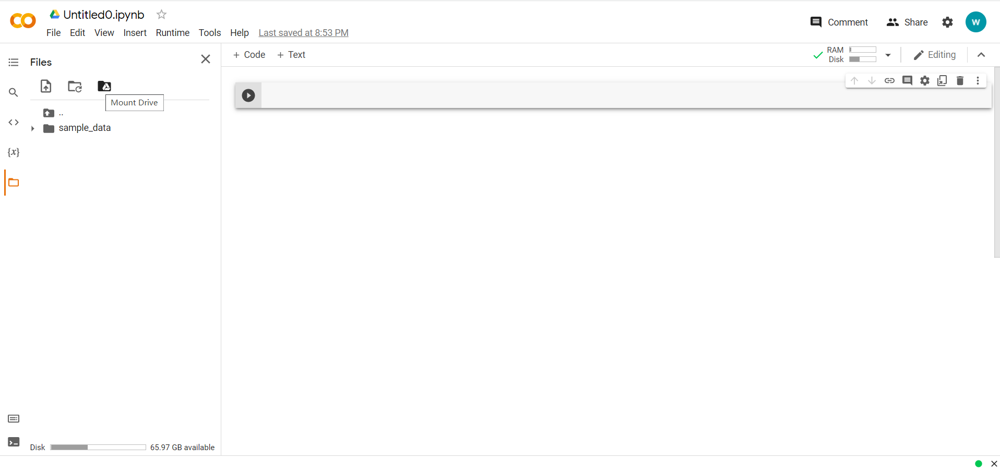
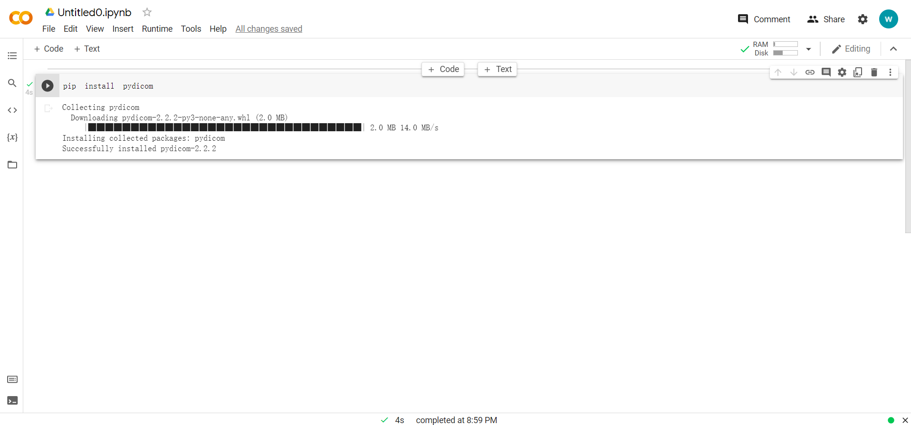
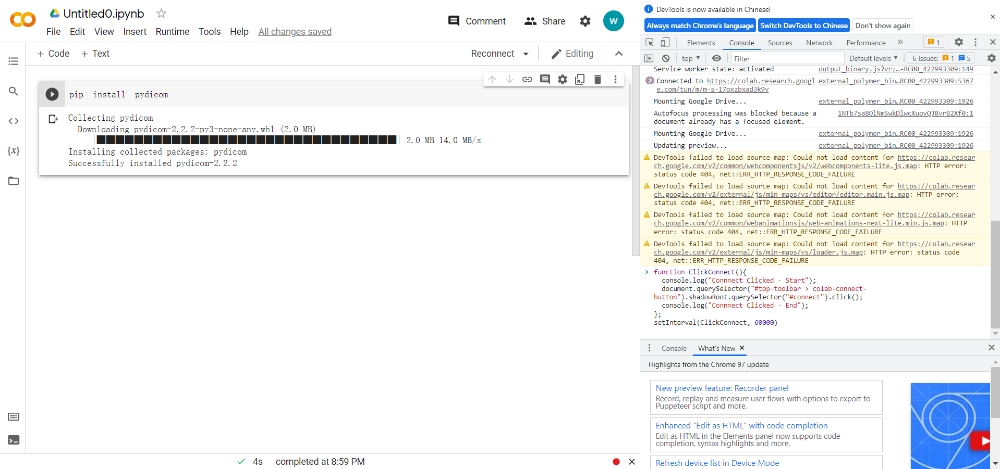

# PytorchGuide

A manual for new starters in our group

## Quick Start Using Google Colab

Google Colab (Colab for short) is a product from Google Research. Colab allows anybody to write and execute python codes and use free GPU source. It is like a Jupyter Notebook plus which allows to run machine learning, data analysis.

Before we start, it is highly recommended that you use Google Chrome browser and this tutorial will be based on the Google Chrome browser

1. Sign in to the [Google Drive](http://drive.google.com/) using your Google username and password

2. After you successfully sign in, you can see the main page which looks like following:


3. To open a new ipynb file, you need to click the "New" button at the top left corner and choose "More" => "Google Colaboratory" like following:


4. To use the free GPU sorce, you need to click "Edit" button in the top toolbar and select "Notebook settings", after that it will show you a window like the picture shown below, you can then choose "GPU" for Hardware accelerator.


5. Finally, click the "Connect" button at the top right corner and wait until it shows the usage of RAM and Disk. Now you could start coding just like using the Jupyter Notebook now!


## Some Important Tips for Google Colab
1. As it is a free GPU source for everyone, Google does set the limitation for the usage of GPU. In my experience, Colab allows you (as a free user) to run model training tasks using GPU for about 8 hours on average and it will restrict your usage if you use too much. My suggestion is that you could run an 8-hour task every day and disconnect it after your training. If it has notified you that you are using too much, stop using it for several days as it will eventually decrease the stable GPU connecting time and you will get nothing if you are disconnected during the training task.

2. Normally, you could upload your dataset into the Google Drive and load it very conviniently. But make sure that you are using the same Google account to log into the Google Drive and the Google Colab. Google Drive provides you with 15G free storage and you can use it by simply clicking the "Files" button at the left toolbar and then click the "Mount Drive" at the top. After giving the permission, you can use the data stored in your drive.


3. Colab has implemented common used libraries for machine learning and data analysis including TensorFlow and Pytorch. Please do check verision before using them! If you do need to use some other libraries which is not installed, you could directly type "pip" command and run the script. Here shows the installation of Pydicom as an example. 


4. For Google Chrome user: press "Ctrl+Shift+J", copy the following code in and then press the "Enter" button
   ```
    function ClickConnect(){
        console.log("Connnect Clicked - Start");
        document.querySelector("#top-toolbar > colab-connect-button").shadowRoot.querySelector("#connect").click();
        console.log("Connnect Clicked - End");
    };
    setInterval(ClickConnect, 60000)
   ```
    
    This will automatically "click" the page and somehow prevent the disconnection when you are sleeping.

5. If you want to import other py files into the Colab, you could add the file path into the system by:
   ```
    import sys
    sys.path.append("/content/drive/path to your py file here")
   ```
    and then you could import them directly

6. There are some scary things hidden in the Colab. Make sure you do not click the "Open settings" button which is next to the "Share" button and then jump to the "Miscellaneous" page.
