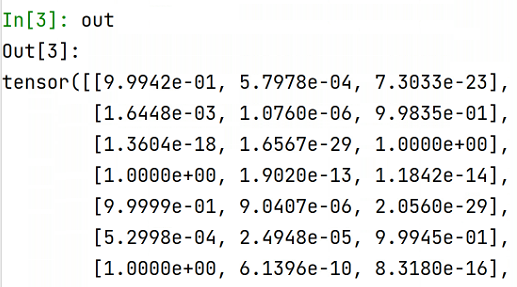

# PytorchGuide

A manual for new starters in our group


## Build your own model

Although this section is named 'build your own model', but I have to admit that I never built a model from scratch. Hooray for torchvision and Github!!


### Models from torchvision

The [torchvision.models](https://pytorch.org/vision/stable/models.html) contains definitions of models for addressing different tasks, including: 

1. image classification

2. pixelwise semantic segmentation

3. object detection

4. instance segmentation

5. person keypoint detection

6. video classification

From all these tasks, image classification and segmentation models are mostly used. 

#### Classification models 

```python
import torchvision.models as models

resnet18 = models.resnet18()
alexnet = models.alexnet()
vgg16 = models.vgg16()
squeezenet = models.squeezenet1_0()
densenet = models.densenet161()
inception = models.inception_v3()
googlenet = models.googlenet()
shufflenet = models.shufflenet_v2_x1_0()
mobilenet = models.mobilenet_v2()
resnext50_32x4d = models.resnext50_32x4d()
wide_resnet50_2 = models.wide_resnet50_2()
mnasnet = models.mnasnet1_0()
```


### Models from Github

Pytorchvision models are easy to implement, but they are not easy to modify. Sometimes I copy and paste the Github models into my 'Models.py' file. By doing so, I could easily adjust the convolutional layers and normalization layers. DO remember to add proper references if your are writing your paper/report.


### Models from scratch

In this section, some basic components in a deep learning network will be introduced. We will start with a simple 2D CNN. 

These basic components include convolutional operations `nn.Cov2d`, activation layers `nn.ReLU`, batch normalization layers `nn.BatchNormalization2D`, and fully connected layers `nn. Linear`. I added an operation calculating the output size of each convolutional and maxpooling layer. 

```python
import torch.nn as nn

# Create CNN Model
class CNNModel(nn.Module):
    def __init__(self,imsize,imchannel,classnum):
        super(CNNModel, self).__init__()
        
        channels = [imchannel,16,32]
        self.imsize = imsize
        
        # Convolution 1
        self.cnn1 = nn.Conv2d(in_channels=channels[0], 
                              out_channels=channels[1], kernel_size=3, stride=1, padding=0)
        # output_size = (input_size - kernel_size + 2 * padding) / stride + 1
        self.imsize = (self.imsize - 3 + 2 * 0) / 1 + 1
        
        self.relu1 = nn.ReLU()
        self.bn1 = nn.BatchNorm2d(channels[1])
        self.maxpool1 = nn.MaxPool2d(kernel_size=2)
        # output_size = input_size / kernel_size
        self.imsize = self.imsize / 2

        # Convolution 2
        self.cnn2 = nn.Conv2d(in_channels=channels[1], 
                              out_channels=channels[2], kernel_size=3, stride=1, padding=0)
        # output_size = (input_size - kernel_size + 2 * padding) / stride + 1
        self.imsize = (self.imsize - 3 + 2 * 0) / 1 + 1
        
        self.relu2 = nn.ReLU()
        self.bn2 = nn.BatchNorm2d(channels[2])
        self.maxpool2 = nn.MaxPool2d(kernel_size=2)
        # output_size = input_size / kernel_size
        self.imsize = self.imsize / 2
        
        # Fully connected 1
        self.fc1 = nn.Linear(channels[2]  * self.imsize * self.imsize, classnum)
        self.softmax = nn.Softmax()

    def forward(self, x):
        # Set 1
        out = self.cnn1(x)
        out = self.relu1(out)
        out = self.bn1(out)
        out = self.maxpool1(out)

        # Set 2
        out = self.cnn2(out)
        out = self.relu2(out)
        out = self.bn2(out)
        out = self.maxpool2(out)

        # Flatten
        out = out.view(out.size(0), -1)

        # Dense
        out = self.fc1(out)
        out = self.softmax(out)

        return out
```

This network is a classification CNN. 

1. The input is a four-dimensional torch.Tensor with a matrix size of [B, C, H, W]. Here B is for batch size, C is for the number of channels (for RGB images, C = 3; for grey scale images, C = 1); H and W are the height and width of images. Mostly, the input images have same H and W. Thus, we use `imsize` to address both H and W. For example, an image with a shape of 256*256 has a `imsize` of 256.

2. The output is the probabilities of each class, with a matrix size of [B, numclass]. Let's take a three-class classification task as an example, the output of which shall be: 

   

   

   The summation of each row equals to 1, because of the softmax operation. 

