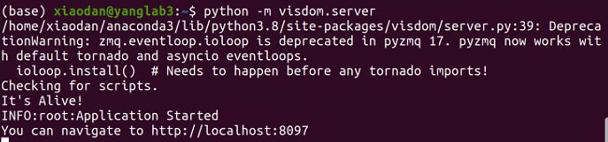
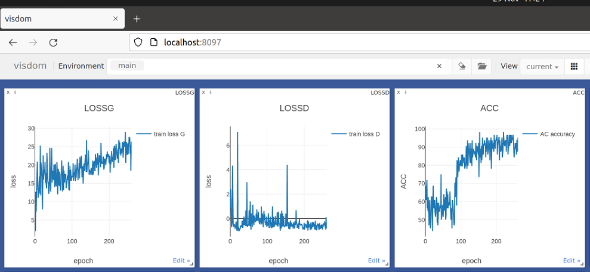

# PytorchGuide

A manual for new starters in our group


## Train your model

After building our dataset and our network, now it is time to train and test some algorithms. I prepared two toy tasks for you to play with. How exciting is that!

Before that, we should begin with some important components in a training file.


### Load your dataset

```python
from CustomDataset import DatasetCT2Dlung
from torch.utils.data import DataLoader

dataset = DatasetCT2Dlung()
dataloader = DataLoader(dataset, batch_size=opt.batchSize,
                                         shuffle=True, num_workers=int(opt.workers))
```


### Load your model

```python
import torchvision.models as models

# Here we choose vgg16
vgg16 = models.vgg16()

# To use multiple GPU
vgg16 = torch.nn.DataParallel(vgg16)
vgg16 = vgg16.cuda()
```


### Initialize training parameters

```python
import torch.optim as optim

criterion = nn.CrossEntropyLoss()
optimizer = optim.SGD(vgg.parameters(), lr=0.001, momentum=0.9)
```


### For training in one epoch

```python
def trainEpoch(epoch):
    running_loss = 0.0
    for i, data in enumerate(dataloader):
            # get the inputs; data is a list of [inputs, labels]
            inputs, labels = data

            # zero the parameter gradients
            optimizer.zero_grad()

            # forward + backward + optimize
            outputs = vgg16(inputs)
            loss = criterion(outputs, labels)
            loss.backward()
            optimizer.step()

            # print statistics
            running_loss += loss.item()
            if i % 2000 == 1999:    # print every 2000 mini-batches
                print('[%d, %5d] loss: %.3f' %
                      (epoch + 1, i + 1, running_loss / 2000))
                running_loss = 0.0
            
            # save models
            torch.save(vgg.state_dict(), './vgg16_epoch_%d.pth' % (epoch))
	return loss
```


### For training iterations

```python
for epoch in range(200):  # loop over the dataset multiple times
	loss = trainEpoch(epoch)
print('Finished Training')
```


### Visualization using visdom

We can use Visdom to visualize the loss curves during training. First

```
pip install visdom
```

Then, connect to visdom server in your command line by 

```
python -m visdom.server
```



You should be able to access your visdom UI now by inputting

```
http://localhost:8097
```

in your browser.



Then, modify your training iteration code as:

```python
import visdom
vis = Visdom() #use_incoming_socket=False
assert vis.check_connection()
win_loss = vis.line(np.arange(10))  # create the window
x_index = []
losses = []

for epoch in range(200):  # loop over the dataset multiple times
	loss = trainEpoch(epoch)
    x_index.append(epoch)
    losses.append(loss)
  
    # plot the curve
    vis.line(X=np.array(x_index),Y=np.array(losses),
    win=win_loss,
    opts=dict(title='LOSS',
    xlabel='epoch',
    xtick=1,
    ylabel='loss',
    markersymbol='dot',
    markersize=5,
    legend=['train loss']))
print('Finished Training')
```

#### I don't like the plotting style of visdom. How to extract the data points and re-plot the training curves for my manuscript?
You can use [visdom-save](https://github.com/theevann/visdom-save) by 
```
python vis.py --save env_name --file file_path
```
All data points in the visdom windows will be saved in a log file which can be read by json.


### Test your model

```python
import torchvision.models as models
import torch

# Define the model structure
vgg16 = models.vgg16()

# If you use multiple GPUs for training, then do not forget this when testing
vgg16 = torch.nn.DataParallel(vgg16)
vgg16 = vgg16.cuda()

# Load parameters
epoch = 100
vgg16.load_state_dict(torch.load('./vgg16_epoch_%d.pth' % (epoch)))
vgg16.eval()

# Define test dataset
from CustomDataset import DatasetCT2DlungTest
from torch.utils.data import DataLoader

dataset = DatasetCT2DlungTest()
testloader = DataLoader(dataset, batch_size=opt.batchSize,
                                         shuffle=True, num_workers=int(opt.workers))
# Test
def test():
    with torch.no_grad():
        running_loss = 0
        for i, data in enumerate(testloader):
                # get the inputs; data is a list of [inputs, labels]
                inputs, labels = data
                outputs = vgg16(inputs)
                loss = criterion(outputs, labels)


                # print statistics
                running_loss += loss.item()
		print(running_loss)
```


## Toy tasks
