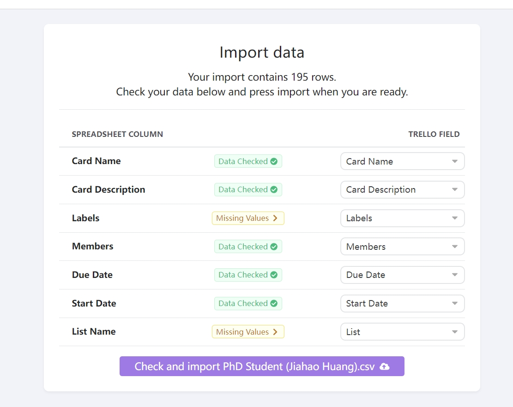

# How to Transfer a Trello Board to a New Account

Note
first version: 05/25/2024
latest version: 05/25/2024

## Background

Transfer Trello to another account

## Step1: Export the old board

1. Go to the old board

2. Find "Power Ups" (You might ask Dr Guang for the board administrator permission)

3. Install "Exports by Blue Cat"

4. Export the board using "Exports by Blue Cat"

## Step2: Create a new board in new account 

1. Go to the new workspace and create a new board

2. Create same lists as the old board

Tips: This is important the following imports since if the list is not the same, the card will be imported to the default list

3. Create same labels as the old board

Tips: This is important the following imports since if the label is not the same, the card will be imported to the default label

## Step3: Import the board to the new account

1. Go to the new board
   
2. Find "Power Ups"

3. Install "Imports by Blue Cat"

4. Import the board using "Imports by Blue Cat"

Notice: if you haven't create lists and labels (Step2-2 and Step2-3), it shows warning like this:

Done:

