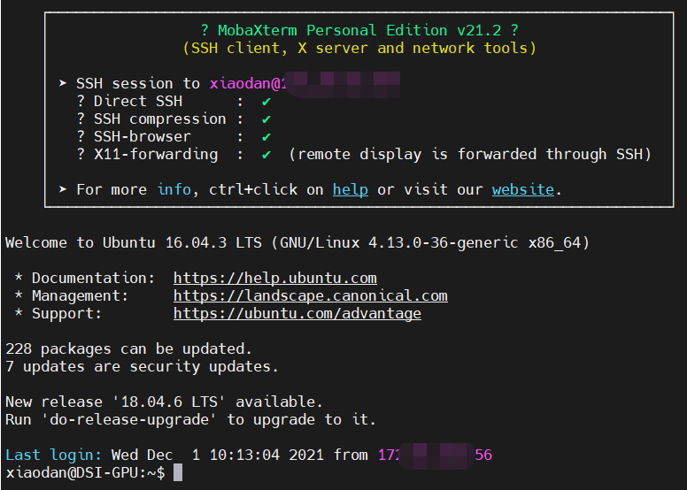
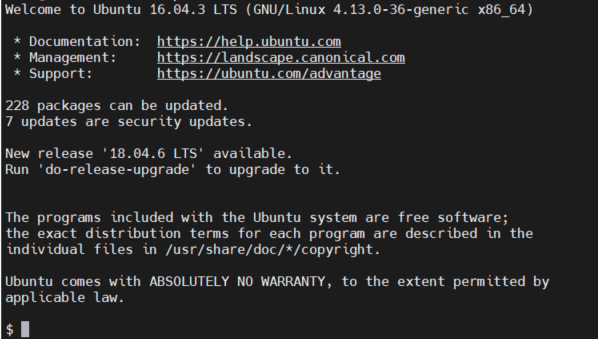
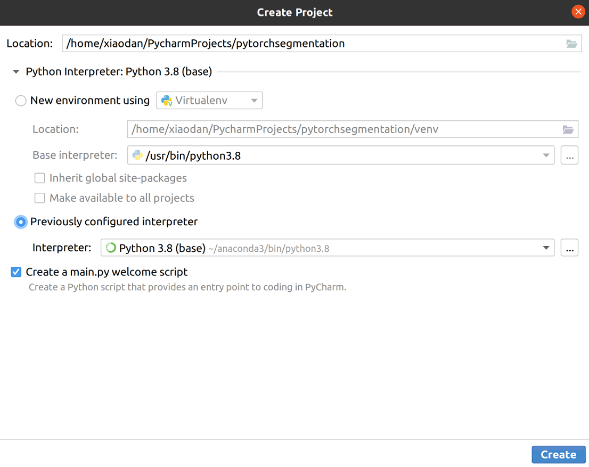

# Introduction

After learning some thrilling theoretical knowledge about deep learning and medical image analysis, it is time to start a hands-on project! This note will cover all the tips you will need to start a toy project on your own. We will learn to set up a new environment using anaconda, debug python project using Pycharm (it is okay to use other IDLEs), and build a sample segmentation project, segmenting LV from cardiac MR images. 

## SSH connection

Before we start, it is highly recommended that you use a Linux op system. In our group, we assigned dsi-gpu to undergraduate students. Here are several tips for new linux users: 

1. Download MobaXtern (for commanding) and WinSCP (for file transfer). 

2. Open MobaXtern 

   1. Click session->ssh; remote host is the ip address, username is your name. Then you shall be connected. See picture below.
   

   !!!!!!ATTENTION: There might be no yourname@ip prefix in your command line, i.e., your command window looks like

   

   This means that you did not enter bash. Type in `/bin/bash` to enter bash. And if you encounter this situation, please DO contact the PhD student who created your account for you to fix this problem. 

   2. In the command line, input `ls ` and this command will display all the files under your private folder. 

3. Open WinSCP

   

---
<br>
<br>
<br>


## Setting up an environment in python: 

1. Download anaconda 3 from [here](https://www.anaconda.com/).  

2. Copy the sh file to your private folder '/home/yourname/' and run it with 

   ```
   sh Anaconda3-2021.05-Linux-x86_64.sh 
   ```

3. After successful installation, input below commands to activate your base environment. At most of the time, it is okay to use base environment directly. If you are still interested in creating independent virtual environment for each of your projects, you can search 'conda virtual env creation' with Google.  

   ```
   conda activate 
   ```

4. Input  below commands to install python for your base environment and check if your python is installed successfully. The output of `which python` should be your anaconda directory.

   ```
   conda install python==3.7 
   which python 
   which pip 
   ```

5. We recommend pytorch for starters as the toolkit for deep learning. It is easier to compile and debug (than Tensorflow/Keras/Caffee).  

   ```
   # The cuda version in the default setting is CUDA 11.1
   
   # Pytorch
   conda install pytorch==1.9.0 torchvision==0.10.0 torchaudio==0.8.0 cudatoolkit=11.1 -c pytorch -c conda-forge
   # Tensorflow
   pip install tensorflow==2.4.0
   ```

6. We recommend [Pycharm](https://www.jetbrains.com/pycharm/) as your IDE when you are programming with python. It is okay to choose others. For Pycharm new starters, download Pycharm in your home directory, and unzip the file you downloaded. In your home directory (for me, it is /home/xiaodan/) create a file named "pycharm.sh". Write below content in this file. Remember the directory name should match with your directory. 

   ```
   #!/bin/bash
   bash /home/xiaodan/pycharm-community-xxxx.xx.xx/bin/pycharm.sh
   ```

7. Then, input below commands to start Pycharm.

   ```
   sh pycharm.sh
   ```

8. Try to create a new project in Pycharm. Remember to use 




## Starting an simple pytorch project: 

For more instructions on how to build your own dataset, please see in [Dataloader](boilerplate_code/Dataloader.md).

For more instructions on how to build your own network, please see in [Models](boilerplate_code/Models.md).

For more instructions on how to start training procedures, please see in [training and testing](boilerplate_code/Train.md).
