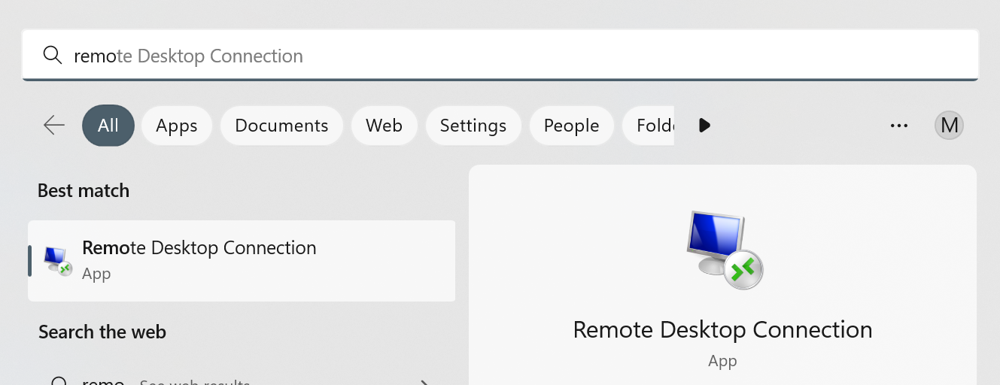
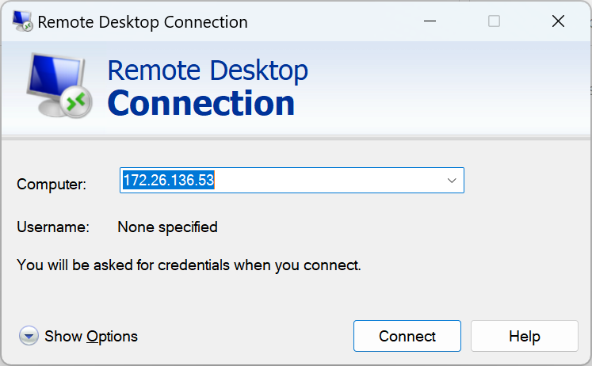
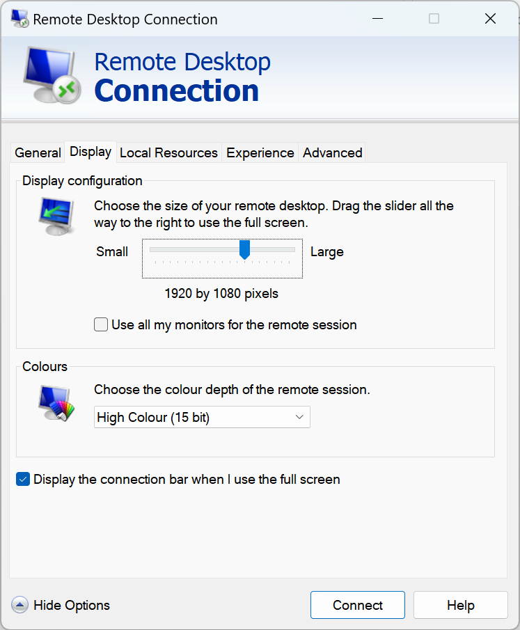
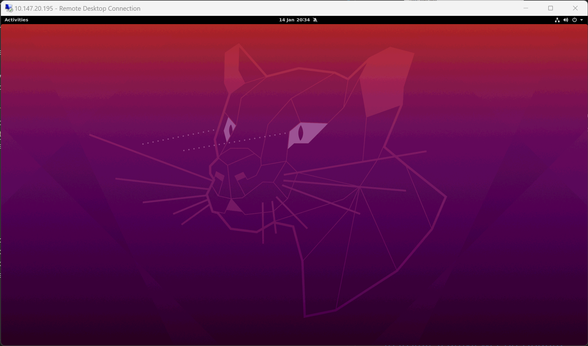

# <span style="color:#2E86C1 ">*GUI - Remote Desktop*</span>


## <span style="color:#2E86C1 ">*Install xrdp on ubuntu*</span>

1. download [install script](https://www.c-nergy.be/products.html) or use the [backup here](utils/xrdp-installer-1.4.6.sh)
2. execute the following commands
    ``` bash
    cd ~
    mkdir Downloads 
    # remember to modify the file name
    chmod 777 xrdp-installer-1.4.6.sh
    ./xrdp-installer-1.4.6.sh
    ```
3. restart the workstation by `'shutdown -r now'`

* `reference`
    > https://www.80sy.com/715/html <br>
    > http://c-nergy.be/blog/?p=13663 <br>
    > https://www.c-nergy.be/products.html 


<br>
<br>


## <span style="color:#2E86C1 ">*Set up `remote desktop app` on your laptop*</span>

For `Windows`
1. search `remote desktop connection` by `win+s` <br>
    
2. key in zerotier IP address <br>
    
3. set resolution and colors <br>
    
4. follow on-screen protocol to login into your server account
    * type in your username and passwd, same as ssh connection
5. you will see <br>
    


For `Mac`
1. download [`remote desktop connection`](https://apps.apple.com/app/microsoft-remote-desktop/id1295203466?mt=12)
2. same as `windows` operation 2/3/4


<br>
<br>


## <span style="color:#2E86C1 ">*`Optional:` to disable animation on Ubuntu*</span>
1.	Launch software (From Applications)
2.	Search GNOME Tweaks and install it
3.	Launch GNOME Tweaks
4.	Appearance `Animation` OFF


<br>
<br>


## <span style="color:#2E86C1 ">*Install Teamviewer on Ubuntu to get a stable remote desktop connection*</span>
1. login `remote desktop connection`
2. download and install [Teamviewer](https://www.teamviewer.com/en/download/linux/)
3. launch Teamviewer
4. on your laptop, open Teamviewer and connect
5. close `remote desktop connection`
6. enjoy your GUI remote desktop with Teamviewer
* `recommended/optional:` <br>
    7.	set up a free Teamviewer account and login into it on the desktop software <br>
    8.	to set up a personal password for access: 
    `Teamviewer --> Extras --> options --> Advanced --> Personal password`


<br>
<br>


## <span style="color:#2E86C1 ">*Install MATLAB on our workstation*</span>
* Require `sudo` authority
1.	Follow standard protocol to register and set up an account with `MATLAB` on `mathworks.com`
2.	Download MATLAB installer (e.g., `matlab_R2022b_glnxa64.zip`)
3.	Open `terminal` in the directory where the installer is located
    ``` bash
    sudo unzip -X -K <installer zip file name> -d matlab_installer
    cd matlab_installer
    sudo ./install
    ```
4.	A GUI window will pop up
5.	Follow on-screen instructions to finish the MATLAB set up
6.	Launch `software` (From `Applications`)
7.	Search `MATLAB` and install it
8.	Follow on-screen instructions to finish setting up `MATLAB` as a stand-alone Application
9.	Launch `MATLAB` (From `Applications`)
